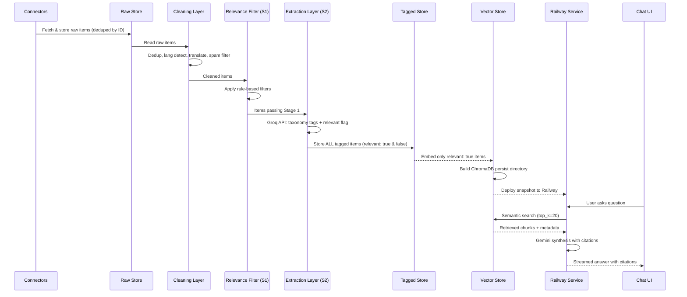

# Architecture: AI-Powered Discovery Engine — Blinkit User Behavior Insights

> Derived from [blinkit-discovery-engine-prd.md](file:///Users/harpreetkaur/Desktop/Harpreet%20Projects/Blinkit/blinkit-discovery-engine-prd.md) · v1.0

---

## Table of Contents

1. [System Overview](#1-system-overview)
2. [High-Level Architecture](#2-high-level-architecture)
3. [Deployment Topology](#3-deployment-topology)
4. [Component Architecture](#4-component-architecture)
   - 4.1 [Ingestion Layer](#41-ingestion-layer)
   - 4.2 [Cleaning Layer](#42-cleaning-layer)
   - 4.3 [Relevance Filter](#43-relevance-filter)
   - 4.4 [Extraction Layer](#44-extraction-layer)
   - 4.5 [Vector Store](#45-vector-store)
   - 4.6 [RAG Chat Layer](#46-rag-chat-layer)
   - 4.7 [Insight Summary Generator](#47-insight-summary-generator)
5. [Data Models & Schemas](#5-data-models--schemas)
6. [Data Flow](#6-data-flow)
7. [Directory Structure](#7-directory-structure)
8. [Technology Stack](#8-technology-stack)
9. [API Design](#9-api-design)
10. [Cost & Performance Constraints](#10-cost--performance-constraints)
11. [Security & Compliance](#11-security--compliance)
12. [Observability & Reporting](#12-observability--reporting)
13. [Risk Mitigations in Architecture](#13-risk-mitigations-in-architecture)

---

## 1. System Overview

The Discovery Engine is a **batch-ingestion, RAG-based research tool** that transforms unstructured user feedback from multiple public sources into a queryable knowledge base. It is designed as a single-owner research instrument — not a production SaaS product.

**Core responsibilities:**
- Ingest user-generated content from 5–7 public sources (app reviews, Reddit, product reviews, forums, social media)
- Clean, deduplicate, and filter for relevance
- Tag each item against a fixed research taxonomy via LLM extraction
- Embed relevant items into a vector store for semantic retrieval
- Serve a RAG-powered chat interface that answers research questions with cited evidence
- Generate on-demand insight summaries against 8 seed research questions

**Key architectural principle:** The system is split into a local CLI (for safe bulk ingestion from home IPs) and a deployed service (RAG chat + live ingestion endpoints). The ingestion pipeline is a shared core module. This split optimizes for scraping reliability (bulk home IP) while allowing on-demand live refresh on the server.

---

## 2. High-Level Architecture

```
┌──────────────────────────────────────────────────────────────────────────────────────────┐
│                   SHARED PIPELINE MODULE (Runs Locally OR on Railway)                     │
│                                                                                          │
│  ┌─────────────┐  ┌─────────────┐  ┌──────────┐  ┌──────────┐  ┌───────────────────┐    │
│  │  App Store   │  │  Play Store │  │  Reddit  │  │ YouTube  │  │  Tier 2 (Forums,  │    │
│  │  Connector   │  │  Connector  │  │ Connector│  │ Connector│  │  Other Social)    │    │
│  └──────┬───────┘  └──────┬──────┘  └────┬─────┘  └────┬─────┘  └────────┬──────────┘    │
│         │                 │              │              │                 │               │
│         └─────────────────┴──────┬───────┴──────────────┴─────────────────┘               │
│                                  ▼                                                       │
│                    ┌──────────────────────────┐                                           │
│                    │     Raw Store (JSON)      │ ← deduped by source + item ID            │
│                    │   per-source metadata     │                                          │
│                    └────────────┬─────────────┘                                           │
│                                 ▼                                                        │
│                    ┌──────────────────────────┐                                           │
│                    │     Cleaning Layer        │                                          │
│                    │  dedup · lang detect ·    │                                          │
│                    │  translation · spam       │                                          │
│                    └────────────┬─────────────┘                                           │
│                                 ▼                                                        │
│                    ┌──────────────────────────┐                                           │
│                    │  Relevance Filter (S1)    │ ← rule-based, zero-cost                  │
│                    │  length + keyword rules   │                                          │
│                    └────────────┬─────────────┘                                           │
│                                 ▼                                                        │
│                    ┌──────────────────────────┐                                           │
│                    │   Extraction Layer        │ ← single LLM call per item               │
│                    │  taxonomy tagging (S5)    │                                          │
│                    │  + relevant flag (S2)     │                                          │
│                    └────────────┬─────────────┘                                           │
│                                 ▼                                                        │
│                    ┌──────────────────────────┐                                           │
│                    │   Tagged Store (JSON)     │ ← ALL items, including relevant: false    │
│                    └────────────┬─────────────┘                                           │
│                                 │                                                        │
│                          ┌──────┴──────┐                                                 │
│                          ▼             ▼                                                 │
│                   relevant: true   relevant: false                                       │
│                          │          (retained, not                                        │
│                          ▼           embedded)                                            │
│                    ┌──────────────────────────┐                                           │
│                    │  Embedding + ChromaDB     │                                          │
│                    │  (persist directory)      │                                          │
│                    └────────────┬─────────────┘                                           │
│                                 │                                                        │
│                          ┌──────┘                                                        │
│                          ▼                                                               │
│              ChromaDB Storage (Local or Persistent Volume)                               │
│                                                                                          │
└──────────────────────────────────────────────────────────────────────────────────────────┘
                                       │
                           git push / file transfer
                                       │
                                       ▼
┌──────────────────────────────────────────────────────────────────────────────────────────┐
│                          RAILWAY (Deployed Backend Service)                               │
│                                                                                          │
│                    ┌──────────────────────────┐                                           │
│                    │   FastAPI Backend         │                                          │
│                    │  ┌────────────────────┐   │                                          │
│                    │  │ ChromaDB (read)    │   │                                          │
│                    │  └────────┬───────────┘   │                                          │
│                    │           ▼               │                                          │
│                    │  ┌────────────────────┐   │                                          │
│                    │  │ Retrieval Engine   │   │                                          │
│                    │  └────────┬───────────┘   │                                          │
│                    │           ▼               │                                          │
│                    │  ┌────────────────────┐   │                                          │
│                    │  │ Gemini Synthesis   │   │                                          │
│                    │  │ (citations, proxy  │   │                                          │
│                    │  │  flagging, splits) │   │                                          │
│                    │  └────────┬───────────┘   │                                          │
│                    └───────────┼──────────────┘                                           │
│                                ▼ (REST/SSE API)                                           │
└────────────────────────────────┼──────────────────────────────────────────────────────────┘
                                 │
                                 ▼
┌──────────────────────────────────────────────────────────────────────────────────────────┐
│                          VERCEL (Deployed Frontend)                                       │
│                                                                                          │
│                    ┌──────────────────────────┐                                           │
│                    │   Next.js App             │                                          │
│                    │   React UI components     │                                          │
│                    └──────────────────────────┘                                           │
│                                                                                          │
└──────────────────────────────────────────────────────────────────────────────────────────┘
```

---

## 3. Deployment Topology

| Concern | Runs Where | Rationale |
|---|---|---|
| All connectors / scrapers | **Local OR Railway** | Local preferred for bulk to avoid IP ban; Railway for live triggers |
| Cleaning, filtering, extraction | **Local OR Railway** | Local preferred for large batches to avoid compute cost |
| Embedding generation | **Local OR Railway** | Both environments write to ChromaDB |
| ChromaDB persist directory | **Local dir OR Railway Persistent Volume** | Must use persistent volume on Railway so ingestion isn't lost on deploy |
| FastAPI + RAG retrieval + synthesis | **Railway** | Handles chat endpoints AND `/api/ingest` background tasks |
| Chat UI (Next.js) | **Vercel** | Modern React frontend, free tier hosting |

### Refresh Cycle

Two ways to ingest data:

1. Local Bulk Ingest:
   (Local pipeline → chroma_snapshot/ → deploy to Railway Persistent Volume)

2. Live Server Ingest:
   (Client hits POST /api/ingest → Railway FastAPI background task → writes directly to Persistent Volume)

---

## 4. Component Architecture

### 4.1 Ingestion Layer

Each source has a dedicated connector module. All connectors write to a unified **raw store** (JSON-lines files or SQLite, keyed by `source + item_id`).

#### Connector Registry

| Connector | Build Tier | Library / Method | Dedup Key | Expected Volume |
|---|---|---|---|---|
| `app_store` | Tier 1 | `serpapi` (Apple App Store Reviews) | `source:appstore` + review ID | 500–1000+ |
| `play_store` | Tier 1 | `google-play-scraper` | `source:playstore` + review ID | 500–1000+ |
| `reddit` | Tier 1 (value) | Arctic Shift + PullPush.io (via BAScraper) | `source:reddit` + post/comment ID | 500–1000+ |
| `youtube` | Tier 1 | YouTube Data API (free quota) | `source:youtube` + comment ID | 500–1000+ |
| `forums` | Tier 2 | Per-forum scraper (BS4) | `source:{forum_name}` + post ID | Lower, best-effort |

#### Connector Interface (Python Protocol)

```python
from typing import Protocol
from dataclasses import dataclass
from datetime import datetime

@dataclass
class RawItem:
    source: str              # e.g. "playstore", "reddit", "youtube"
    item_id: str             # unique within source
    text: str                # raw user-generated text
    timestamp: datetime      # when the review/comment was posted
    rating: float | None     # star rating if applicable
    url: str | None          # link back to original
    metadata: dict           # source-specific fields (subreddit, product_category, etc.)

class SourceConnector(Protocol):
    source_name: str
    tier: int  # 1 or 2

    def fetch(self, since: datetime, limit: int | None = None) -> list[RawItem]:
        """Fetch items from this source. Idempotent — re-fetching same items is safe."""
        ...
```

#### Reddit Connector — Special Design

> **Access method change (July 2026):** Reddit has closed self-service developer registration under its "Responsible Builder Policy," so PRAW / official API keys are no longer obtainable. The `.json` URL fallback also returns 403 as of May 2026. This connector now uses two free, keyless, community-maintained Reddit data mirrors.

**Data mirrors:**

| Service | Role | Base URL | Constraint |
|---|---|---|---|
| **Arctic Shift** | Primary for subreddit-scoped queries | `https://arctic-shift.photon-reddit.com` | Full-text search is scoped to a single subreddit (or user) per query — cannot search Reddit-wide |
| **PullPush.io** | Primary for Reddit-wide queries; fallback for Arctic Shift | `https://pullpush.io` | Supports Reddit-wide full-text search |

**Library:** [BAScraper](https://github.com/maxjo020418/BAScraper) (`pip install BAScraper`) — an async Python wrapper that already wraps both Arctic Shift and PullPush with built-in rate-limit management. Requires Python 3.12+.

```python
from BAScraper.BAScraper_async import PullPushAsync, ArcticShiftAsync
```

**Query routing:**

- **Arctic Shift** (`ArcticShiftAsync`) for subreddit-scoped branded queries — searches within specific subreddits (e.g., `r/india`, `r/bangalore`, `r/mumbai`, `r/IndianFoodPhotography`).
  - Endpoint: `/api/posts/search?subreddit={sub}&title={query}&after={date}&before={date}&limit=100`
  - Endpoint: `/api/comments/search?subreddit={sub}&body={query}&after={date}&before={date}&limit=100`
- **PullPush** (`PullPushAsync`) for Reddit-wide broadened queries — searches across all subreddits for quick-commerce terms that Arctic Shift cannot handle.

**Fallback is mandatory:** If Arctic Shift returns an error or times out, retry the same query via PullPush, and vice versa. The connector must not implement a single-service path.

**Query sets (unchanged from original design):**

```python
QUERY_SETS = {
    "branded": ["blinkit", "blinkit review", "blinkit delivery", ...],
    "quick_commerce": ["quick commerce india", "instant delivery grocery", "10 minute delivery", ...]
}

# Routing:
# branded queries → Arctic Shift (subreddit-scoped, one sub at a time)
# quick_commerce queries → PullPush (Reddit-wide)
```

Both query sets write to the same raw store keyed by Reddit post/comment ID. A post matching both sets carries both query-match tags but is stored **once** — preventing double-counting in volume reporting.

**Reliability profile:** Reddit remains Tier 1 by research value (richest qualitative source), but its access reliability is now "free but unofficial" — both Arctic Shift and PullPush are volunteer-maintained community projects with no uptime guarantee and may lag on very recent threads (archive mirrors, not live Reddit).

#### Recency Window

All connectors apply a **12–18 month lookback** filter at fetch time. Content older than this is discarded at ingestion, not later in the pipeline.

---

### 4.2 Cleaning Layer

Operates on the raw store **in-place** (adds cleaning metadata fields; does not delete originals).

```
Input: RawItem
Output: CleanedItem (RawItem + cleaning metadata)
```

| Step | Implementation | Behavior |
|---|---|---|
| **Deduplication** | Hash on normalized text (lowercased, whitespace-collapsed) | Exact and near-exact duplicates merged; keep earliest instance |
| **Language Detection** | `langdetect` or `fasttext` language ID | Classify as `en`, `hi`, `hinglish`, or `other` |
| **Translation/Normalization** | `deep-translator` package (Google Translate API) | Hinglish/code-mixed → English; regional languages → English. Original text retained in `original_text` field |
| **Spam Filter** | Rule-based heuristics & regex blocklists | Flag promotional content, adult/crypto spam, B2B/hiring jargon, bot-generated reviews |

#### Hinglish/Code-Mixed Handling

Hinglish is prevalent in Indian app reviews. The pipeline:
1. Detects code-mixed content via character-set analysis (Devanagari + Latin mix) and `langdetect` confidence thresholds
2. Sends to `deep-translator` for sequential normalization (e.g., "bahut accha product hai but delivery slow tha" → "Very good product but delivery was slow")
3. Stores both `original_text` and `normalized_text`; downstream processing uses `normalized_text`

---

### 4.3 Relevance Filter

Two-stage filter that controls what reaches the vector store. **Nothing is deleted** — all items and their tags are retained in the tagged store.

#### Stage 1: Rule-Based (Zero LLM Cost)

```python
# Expanded to separate tech glitches from trust barriers
TECH_ONLY_VOCAB = [
    "crash", "lag", "freeze", "login", "otp", "payment fail", "bug",
    "update", "version", "install", "deducted", "money deducted", ...
]

BEHAVIOR_SIGNAL_WORDS = [
    "try", "first time", "always order", "compare", "trust", "quality",
    "delivery boy", "packaging", "late", "bad experience", ...
]

GENERIC_PHRASES = ["very good", "good", "nice", "great app", "worst app", ...]

def stage1_filter(item: CleanedItem) -> bool:
    """Returns True if item should proceed to Stage 2 (LLM extraction)."""
    text = item.normalized_text.lower()
    
    # Rule 0: Generic Phrase Pruning
    if clean_text in GENERIC_PHRASES:
        return False

    # Rule 1: Too short AND no category mention → discard
    if len(text) < 25 and not any(kw in text for kw in CATEGORY_KEYWORDS):
        return False

    # Rule 2: Only tech vocabulary AND no behavior signal AND no delivery complaints → discard
    has_tech = any(kw in text for kw in TECH_ONLY_VOCAB)
    has_behavior = any(kw in text for kw in BEHAVIOR_SIGNAL_WORDS)
    if has_tech and not has_behavior:
        return False
        
    # Rule 3: Snippeting for long text (e.g. Reddit)
    if len(text.split()) > 100:
        # Extract only sentences surrounding keywords to save LLM tokens
        item.normalized_text = extract_snippets(item.normalized_text)

    # Ambiguous → pass through to Stage 2
    return True
```

#### Stage 2: LLM `relevant` Flag

Not a separate call — part of the extraction prompt (Section 4.4). The same LLM call that produces taxonomy tags also outputs `relevant: true/false`. Only `relevant: true` items are embedded.

---

### 4.4 Extraction Layer

A single LLM API call per item produces the full Section 5 taxonomy tags **plus** the relevance determination.
We use **Gemini as the primary model (`gemini-flash-latest`)** and **Groq as the fallback (`llama-3.3-70b-versatile`)**.

#### Extraction Prompt Design

```
System: You are a research assistant analyzing user-generated text about 
quick-commerce and online shopping in India. Tag each item against a fixed 
research taxonomy. Be precise — use only the canonical category names provided.

Input:
- source: {source}
- evidence_type: {evidence_type}  
- text: {normalized_text}

Output (JSON):
{
  "results": [
    {
      "relevant": boolean,           // Does this text contain signal about category 
                                     // behavior, discovery, trust, or shopping habits?
      "category_mentioned": string,  // From canonical list, or "other" / "not stated"
      "category_tier": string,       // "core" | "exploratory" | "not stated"
      ...
      "source_snippet": string       // exact excerpt supporting the tags
    }
  ]
}
```

#### Batching & Cost Control

- **Batch size:** 10 items per API call (structured as a JSON array in the prompt)
- **Primary Model:** Gemini is used as primary due to strong reasoning context length.
- **Fallback Model:** Groq Llama-3.3-70b is used if Gemini fails or rate limits.
- **Rate limiting:** 1s sleep per batch. Target 500–1000 items/source × 5 sources = 2,500–5,000 total extraction calls (batched to ~250–500 API calls)

---

### 4.5 Vector Store

**Technology:** ChromaDB (local persistent mode)

#### Embedding Strategy

| Aspect | Decision |
|---|---|
| **What gets embedded** | Only `relevant: true` items |
| **Text embedded** | `normalized_text` (not the raw text) |
| **Embedding model** | `BAAI/bge-small-en-v1.5` via `sentence-transformers` (local, free) |
| **Metadata stored alongside embedding** | All taxonomy tags, `source`, `evidence_type`, `item_id`, `source_snippet`, `timestamp` |
| **Collection structure** | Single collection; filtering via metadata at query time |

#### ChromaDB Schema

```python
collection.add(
    ids=[item.item_id],
    documents=[item.normalized_text],
    metadatas=[{
        "source": item.source,
        "evidence_type": item.evidence_type,
        "category_mentioned": item.tags.category_mentioned,
        "category_tier": item.tags.category_tier,
        "behavior_type": item.tags.behavior_type,
        "discovery_channel": item.tags.discovery_channel,
        "barrier_type": item.tags.barrier_type,
        "frustration_summary": item.tags.frustration.summary,
        "frustration_severity": item.tags.frustration.severity,
        "unmet_need": item.tags.unmet_need,
        "segment_signal": item.tags.segment_signal,
        "sentiment": item.tags.sentiment,
        "source_snippet": item.tags.source_snippet,
        "timestamp": item.timestamp.isoformat(),
    }],
    embeddings=[embedding_vector]
)
```

#### Storage & Persistence

Locally, ChromaDB writes to `chroma_snapshot/`. On Railway, the database must be mapped to a **Persistent Volume**. This allows the deployed service to both read for RAG queries and write new data during live `/api/ingest` jobs without losing data on the next deployment.

---

### 4.6 RAG Chat Layer

The RAG Chat Layer is split into a **Backend (Railway)** and **Frontend (Vercel)**:

```
┌──────────────────────────────────────────────┐       ┌────────────────────────┐
│             Backend (Railway)                 │       │    Frontend (Vercel)    │
│                                              │       │                        │
│  ┌─────────────┐     ┌──────────────┐        │       │    ┌───────────┐       │
│  │  Retriever   │────►│  Synthesizer │───────┼───────►    │  Chat UI  │       │
│  │ (ChromaDB    │     │  (Gemini API │ (SSE) │       │    │ (Next.js/ │       │
│  │  similarity  │     │   + prompt   │       │       │    │  React)   │       │
│  │  search)     │     │   template)  │       │       │    └───────────┘       │
│  └─────────────┘     └──────────────┘        │       │                        │
└──────────────────────────────────────────────┘       └────────────────────────┘
```

#### Retriever

```python
def retrieve(query: str, top_k: int = 20, filters: dict | None = None) -> list[RetrievedItem]:
    """
    Semantic search against ChromaDB.
    - top_k: number of candidate chunks to retrieve
    - filters: optional metadata filters (e.g. source, category_tier)
    Returns items with similarity scores and full metadata.
    """
```

- Default `top_k = 20` to give the synthesizer enough evidence diversity
- Supports metadata filtering (e.g., "only direct evidence", "only exploratory categories")
- Results sorted by relevance score

#### Synthesizer

Gemini API call that takes retrieved chunks + the user question and produces:

1. **Synthesized answer** — grounded in retrieved evidence
2. **Citations** — each claim linked to specific `source_snippet` + `source` + `item_id`
3. **Evidence-type flagging** — proxy evidence explicitly called out (if any proxy sources are added later).
4. **Split handling** — when evidence is contradictory, present the split with relative frequency (e.g., _"12 of 40 reviews say X, while 8 say Y"_) rather than false consensus
5. **Sample size disclosure** — quantified claims state their n (e.g., _"based on 23 Play Store reviews and 7 Reddit comments"_)

#### Synthesis Prompt Template

```
You are a research analyst answering questions about Blinkit user behavior, 
based ONLY on the retrieved evidence below. Follow these rules strictly:

1. Every claim must cite its source snippet with [Source: {source}, ID: {id}]
2. When using evidence tagged evidence_type: proxy, explicitly flag it: 
   "General e-commerce pattern, not Blinkit-specific"
3. When evidence is split or contradictory, present both sides with counts
4. State sample sizes for any quantified claim
5. If retrieved evidence is insufficient, say so — do not fabricate
6. Per-source breakdown: note how many items came from each source

Evidence:
{retrieved_chunks_with_metadata}

Question: {user_question}
```

#### Chat UI

A Next.js application deployed to Vercel:

- Text input for natural-language questions
- Streaming response display (SSE from FastAPI)
- Collapsible citation cards showing source snippet, source name, evidence type
- Source-volume indicator (how many items from each source contributed to the answer)
- Pre-loaded quick-access buttons for the 8 seed research questions
- **Pipeline Control Panel**: Expandable panel allowing users to trigger Live Ingestion with two modes:
  - **Quick Demo Run (🚀)**: Fetches ~30 items per connector for fast testing (~30-45s)
  - **Full Pipeline Run (⚡)**: Complete dataset ingestion across all sources

---

### 4.7 Insight Summary Generator

An on-demand report generator that runs all 8 seed research questions through the RAG pipeline and compiles the results into a structured document.

```python
SEED_QUESTIONS = [
    "Why do users repeatedly buy from the same categories?",
    "What prevents users from exploring new categories?",
    "How do users discover products today?",
    "What role do habits play in shopping behavior?",
    "What information do users need before trying a new category?",
    "What frustrations emerge repeatedly?",
    "Which user segments are more likely to experiment?",
    "What unmet needs emerge consistently across discussions?",
]
```

**Output includes:**
- Answer to each question with citations
- Per-source volume funnel (raw ingested → passed filter → embedded) per FR12
- Emergent themes not covered by the 8 seed questions (taxonomy-driven: scan for tag clusters that don't map to any seed question)
- Confidence indicators based on evidence volume and source diversity

---

## 5. Data Models & Schemas

### 5.1 Raw Item Schema

```json
{
  "item_id": "playstore_review_abc123",
  "source": "playstore",
  "text": "Original review text as scraped",
  "timestamp": "2025-08-15T10:30:00Z",
  "rating": 4.0,
  "url": "https://play.google.com/...",
  "metadata": {
    "app_version": "4.52.1",
    "reviewer_name": "UserXYZ",
    "helpful_count": 12
  },
  "ingested_at": "2026-07-18T12:00:00Z"
}
```

### 5.2 Cleaned Item Schema (extends Raw)

```json
{
  "...raw_fields": "...",
  "cleaning": {
    "is_duplicate": false,
    "duplicate_of": null,
    "detected_language": "hinglish",
    "original_text": "bahut accha product hai but delivery slow tha",
    "normalized_text": "Very good product but delivery was slow",
    "is_spam": false,
    "stage1_passed": true
  }
}
```

### 5.3 Tagged Item Schema (extends Cleaned)

```json
{
  "...cleaned_fields": "...",
  "tags": {
    "relevant": true,
    "category_mentioned": "Dairy & Bakery",
    "category_tier": "core",
    "behavior_type": "repeat-purchase",
    "discovery_channel": "app home feed",
    "barrier_type": "not stated",
    "frustration": {
      "summary": "Delivery speed inconsistent for fresh items",
      "severity": "med"
    },
    "unmet_need": "Wants guaranteed freshness for dairy products",
    "segment_signal": "homemaker/family shopper",
    "sentiment": "neutral",
    "evidence_type": "direct",
    "source_snippet": "I always order milk and bread from Blinkit but sometimes the delivery takes too long and items aren't fresh"
  }
}
```

### 5.4 Canonical Category Enum

```python
from enum import Enum

class CategoryMentioned(str, Enum):
    # Core
    FRUITS_VEGETABLES = "Fruits & Vegetables"
    DAIRY_BAKERY = "Dairy & Bakery"
    SNACKS_BEVERAGES = "Snacks & Beverages"
    STAPLES_GROCERY = "Staples/Grocery"
    PERSONAL_CARE_CLEANING = "Personal Care & Cleaning"

    # Exploratory
    ELECTRONICS = "Electronics & Accessories"
    BEAUTY_SKINCARE = "Beauty & Skincare"
    PHARMACY_HEALTH = "Pharmacy/Health"
    BABY_CARE = "Baby Care"
    PET_CARE = "Pet Care"
    STATIONERY_PRINT = "Stationery & Print"
    HOME_KITCHEN = "Home & Kitchen"
    BOOKS = "Books"

    # Catch-all
    OTHER = "other"
    NOT_STATED = "not stated"

class CategoryTier(str, Enum):
    CORE = "core"
    EXPLORATORY = "exploratory"
    NOT_STATED = "not stated"
```

### 5.5 Volume Funnel Report Schema

```json
{
  "source": "playstore",
  "tier": 1,
  "counts": {
    "raw_ingested": 1200,
    "after_dedup": 1150,
    "after_cleaning": 1100,
    "stage1_passed": 850,
    "relevant_true": 620,
    "embedded": 620
  },
  "timestamp": "2026-07-18T15:00:00Z"
}
```

---

## 6. Data Flow

### 6.1 End-to-End Pipeline Sequence



### 6.2 Pipeline Orchestration

The local pipeline is orchestrated by a single Python CLI entry point:

```
python -m pipeline run --sources tier1 --limit 1000
python -m pipeline run --sources all --limit 500       # include Tier 2
python -m pipeline run --sources playstore --limit 30   # dry-run single source
python -m pipeline export-snapshot                      # produce chroma_snapshot/
python -m pipeline report                               # volume funnel per source
python -m pipeline generate-summary                     # 8-question insight report
```

---

## 7. Directory Structure

```
blinkit-discovery-engine/
├── README.md
├── architecture.md                     # ← this document
├── blinkit-discovery-engine-prd.md
├── requirements.txt
├── .env.example                        # API keys template
│
├── pipeline/                           # Local batch pipeline
│   ├── __init__.py
│   ├── __main__.py                     # CLI entry point
│   ├── config.py                       # Settings, constants, enums
│   │
│   ├── connectors/                     # Ingestion Layer (4.1)
│   │   ├── __init__.py
│   │   ├── base.py                     # SourceConnector protocol
│   │   ├── app_store.py
│   │   ├── play_store.py
│   │   ├── reddit.py
│   │   ├── youtube.py                  # YouTube Data API
│   │   └── forums.py                   # Tier 2
│   │
│   ├── cleaning/                       # Cleaning Layer (4.2)
│   │   ├── __init__.py
│   │   ├── dedup.py
│   │   ├── language.py                 # Detection + translation
│   │   └── spam.py
│   │
│   ├── filtering/                      # Relevance Filter (4.3)
│   │   ├── __init__.py
│   │   └── rules.py                    # Stage 1 rule-based filter
│   │
│   ├── extraction/                     # Extraction Layer (4.4)
│   │   ├── __init__.py
│   │   ├── extractor.py                # Groq API taxonomy tagging
│   │   └── prompts.py                  # Prompt templates
│   │
│   ├── embedding/                      # Vector Store builder (4.5)
│   │   ├── __init__.py
│   │   └── embedder.py                 # ChromaDB population
│   │
│   ├── reporting/                      # Volume funnel + insight summary (4.7)
│   │   ├── __init__.py
│   │   ├── funnel.py
│   │   └── summary.py
│   │
│   └── store/                          # Storage backends
│       ├── __init__.py
│       ├── raw_store.py                # JSON-lines / SQLite for raw items
│       └── tagged_store.py             # JSON-lines / SQLite for tagged items
│
├── server/                             # Deployed RAG service (4.6)
│   ├── __init__.py
│   ├── main.py                         # FastAPI app
│   ├── retriever.py                    # ChromaDB semantic search
│   ├── synthesizer.py                  # Gemini synthesis + citation formatting
│   └── models.py                       # Pydantic request/response models
│
├── frontend/                           # Deployed Next.js UI (Vercel)
│   ├── package.json
│   ├── next.config.js
│   ├── src/
│   │   ├── app/                        # Next.js App Router
│   │   └── components/                 # React UI components
│
├── data/                               # Local data (gitignored except snapshot)
│   ├── raw/                            # Raw store output
│   ├── tagged/                         # Tagged store output
│   └── chroma_snapshot/                # ChromaDB persist dir → deployed
│
├── tests/
│   ├── test_connectors.py
│   ├── test_cleaning.py
│   ├── test_filtering.py
│   ├── test_extraction.py
│   └── test_retrieval.py
│
├── Dockerfile                          # For Railway deployment
├── railway.toml                        # Railway config
└── .gitignore
```

---

## 8. Technology Stack

| Layer | Technology | Rationale |
|---|---|---|
| **Language** | Python 3.11+ | Ecosystem richness for scraping, ML, APIs |
| **Web framework** | FastAPI | Async, streaming SSE support, lightweight |
| **LLM (extraction)** | Gemini API (primary) & Groq API (fallback) | High-speed structured output, fault-tolerant |
| **LLM (synthesis)** | Gemini API (Google) | High-quality reasoning and synthesis |
| **Vector store** | ChromaDB | Local persistence, simple API, zero-infra |
| **Embeddings** | `sentence-transformers` (`all-MiniLM-L6-v2`) | Free, local, fast; sufficient quality for this scale |
| **Scraping** | `google-play-scraper`, `serpapi`, BAScraper (Arctic Shift + PullPush) | SerpApi handles Apple App Store reviews, rest are free |
| **Language detection** | `langdetect` or `fasttext` | Lightweight, handles Hinglish detection |
| **Translation** | `deep-translator` | Google Translate without API costs |
| **Frontend** | Next.js (React) | Modern component architecture, seamless routing |
| **Deployment** | Vercel (Frontend) + Railway (Backend) | Free tier hosting for both |
| **Containerization** | Docker | Reproducible deployment to Railway |

### Key Python Dependencies

```
# Core
fastapi>=0.100.0
uvicorn>=0.23.0
groq>=0.9.0                 # Groq API client
google-generativeai>=0.5.0  # Gemini API client
chromadb>=0.4.0
deep-translator>=1.11.0     # For translation
sentence-transformers>=2.2.0
pydantic>=2.0

# Scraping (Tier 1)
google-play-scraper>=1.0.0
app-store-scraper>=0.3.5    # or app-store-web-scraper
BAScraper>=0.2.0               # Arctic Shift + PullPush async wrapper (Reddit)
beautifulsoup4>=4.12.0
requests>=2.31.0

# NLP utilities
langdetect>=1.0.9

# YouTube (Tier 1)
google-api-python-client>=2.0  # YouTube Data API

# Dev
pytest>=7.0
python-dotenv>=1.0
```

---

## 9. API Design

### 9.1 Chat Endpoint

```
POST /api/chat
```

**Request:**
```json
{
  "question": "What prevents users from exploring new categories?",
  "filters": {
    "sources": ["playstore", "reddit"],
    "evidence_type": "direct",
    "category_tier": "exploratory"
  },
  "top_k": 20
}
```

**Response (SSE stream):**
```
event: token
data: {"text": "Based on analysis of "}

event: token
data: {"text": "47 user reviews..."}

event: citation
data: {"source": "playstore", "item_id": "ps_123", "snippet": "I never buy electronics...", "evidence_type": "direct"}

event: done
data: {"sources_used": {"playstore": 12, "reddit": 8, "appstore": 5}, "total_items": 25}
```

### 9.2 Summary Endpoint

```
POST /api/summary
```

**Request:**
```json
{
  "questions": "all"  // or a subset of question indices
}
```

**Response:**
```json
{
  "generated_at": "2026-07-18T15:00:00Z",
  "questions": [
    {
      "question": "Why do users repeatedly buy from the same categories?",
      "answer": "...",
      "citations": [...],
      "source_breakdown": {"playstore": 15, "reddit": 8, ...},
      "confidence": "high"  // based on evidence volume & diversity
    }
  ],
  "emergent_themes": [...],
  "volume_funnel": {...}
}
```

### 9.3 Stats Endpoint

```
GET /api/stats
```

**Response:**
```json
{
  "total_embedded": 3200,
  "per_source": {
    "playstore": {"raw": 1200, "embedded": 620, "tier": 1},
    "appstore": {"raw": 800, "embedded": 450, "tier": 1},
    "reddit": {"raw": 950, "embedded": 520, "tier": 1},
    "youtube": {"raw": 600, "embedded": 380, "tier": 1},
    "forums": {"raw": 150, "embedded": 85, "tier": 2}
  },
  "last_refresh": "2026-07-18T15:00:00Z"
}
```

### 9.4 Health Endpoint

```
GET /api/health
```

```json
{
  "status": "ok",
  "chroma_loaded": true,
  "collection_count": 3200,
  "version": "1.0.0"
}
```

### 9.5 Ingestion Endpoints (Server-Side)

```
POST /api/ingest
```
Trigger a background ingestion task. Requires admin authentication.

**Request:**
```json
{
  "mode": "demo", // or "full"
  "sources": ["reddit", "playstore"], // optional override
  "limit": 100 // optional override
}
```
*Note: `mode` dictates the scale. "demo" limits items to ~30 per connector for quick testing (~30-45s). "full" runs full-scale scraping.*

```
GET /api/ingest/status
```
Returns the status of the currently running ingestion job (if any), including progress message, mode, and processed counts.

---

## 10. Cost & Performance Constraints

| Constraint | Target | Mechanism |
|---|---|---|
| **LLM extraction cost** | < $10 total for full pipeline run | Batch 10-20 items/call; prompt caching; ~250-500 API calls total |
| **LLM synthesis cost** | ~$0.01–0.05 per chat query | Single Gemini call per query |
| **Embedding cost** | $0 | Local model (`sentence-transformers`), no API charges |
| **Scraping cost** | $0 | Free libraries, no paid APIs |
| **Railway hosting** | Free tier ($5/month credit) | Read-only service; minimal compute; no scraping on server |
| **Chat response latency** | < 5s to first token | ChromaDB retrieval is local/fast; latency dominated by Gemini API |
| **Full pipeline runtime** | < 2 hours for ~5000 items | Parallelized connectors; batched extraction |

---

## 11. Security & Compliance

| Concern | Approach |
|---|---|
| **API keys** | Stored in `.env`, never committed; `.env.example` documents required keys |
| **PII** | No attempt to de-anonymize; reviewer names stored as-is from public sources but not displayed in UI |
| **ToS compliance** | System is for personal research/case-study only; stated in README; no commercial redistribution |
| **Data retention** | All data stored locally or on a Persistent Volume; deployed app uses Persistent Volume to store vector embeddings. |
| **Network exposure** | Railway service `/api/chat` is public; `/api/ingest` requires an admin secure token to prevent unauthorized scraping/spending. |

---

## 12. Observability & Reporting

### Volume Funnel (FR12)

Every pipeline run produces a per-source volume funnel report:

```
Source: playstore (Tier 1)
├── Raw ingested:     1,200
├── After dedup:      1,150
├── After cleaning:   1,100
├── Stage 1 passed:     850
├── Relevant (true):    620  (73% of S1-passed)
├── Relevant (false):   230  (retained, not embedded)
└── Embedded:           620

Source: forums (Tier 2)
├── Raw ingested:       150
├── ...
└── Embedded:            85  ⚠️ Low volume — directional only
```

### Pipeline Logging

- Each pipeline stage logs to `data/logs/{run_timestamp}.log`
- Structured JSON logging for machine-parseable audit trail
- Extraction failures logged with item ID and error for retry

### Spot-Check Support

The tagged store retains `relevant: false` items so the filter can be audited:

```
python -m pipeline audit-filter --source playstore --sample 20
# Displays 20 randomly sampled discarded items for manual review
```

---

## 13. Risk Mitigations in Architecture

| Risk (from PRD Section 13) | Architectural Mitigation |
|---|---|
| Reddit signal may be thin | Merged query sets (branded + quick-commerce) in single connector; volume funnel surfaces thinness early |
| Reddit mirrors unavailable | Both Arctic Shift and PullPush are volunteer-maintained with no uptime guarantee. Mandatory cross-fallback: if one mirror errors/times out, retry via the other. If both are unreachable, connector fails gracefully with 0 items and a clear error in the funnel report (FR12) |
| Reddit data staleness | Archive mirrors may lag on very recent threads (hours to days). Recency window is 12–18 months so this rarely matters, but the most recent 1–7 days of posts may be missing from results. Documented as a known limitation, not a bug |
| Tier 2 scraping may break | Tier 2 connectors are isolated modules; failure is caught and logged, not propagated; system ships Tier-1-only if needed |
| Uneven source volume biases retrieval | Metadata filtering in retriever allows source-balanced queries; synthesis prompt requires per-source counts |
| Proxy evidence cited as direct | `evidence_type` set at ingestion (not LLM-dependent); synthesis prompt explicitly requires flagging proxy sources |
| Overly aggressive relevance filter | `relevant: false` items retained; `audit-filter` CLI command for spot-checking discards; delivery-complaint exception in Stage 1 rules |
| LLM taxonomy tagging quality | Dry-run gate (20-30 items/source) before full-scale run; canonical category enum prevents free-text fragmentation |
| Datacenter IP Blocking | Railway IPs are more likely to be blocked by Reddit/Play Store than residential IPs. If scraping fails on Railway, the system supports local-only ingestion or integrating a proxy rotation service (e.g., BrightData). |

---

## Appendix: Build Sequence (Spec Mapping)

| Spec | PRD Section | Day | Components Built |
|---|---|---|---|
| **A1** | §6, §8 (FR1-5) | Day 1 | All Tier 1 connectors, raw store, dedup |
| **B** | §5, §7a, §8 (FR6-7b) | Day 1 | Cleaning layer, relevance filter, extraction layer, tagged store |
| **C** | §7b, §8 (FR8-10, 13) | Day 2 | Embedding, ChromaDB, FastAPI backend, retriever, synthesizer, chat UI, Railway deploy |
| **D** | §8 (FR11-12) | Day 3 | Insight summary generator, volume funnel report |
| **A2** | §6, §8 (FR3-4) | Day 3 | Tier 2 connectors (forums, other social) — best-effort |
